# Proyecto: Implementar un modelo de ML aplicado a un problema real considerando aspectos de calidad de datos y mitigación de sesgos, aplicar técnicas de explicabilidad (XAI), reflexionar sobre principios éticos y documentar correctamente el flujo completo del proyecto

**Universidad de Especialidades Espiritu Santo**
**Maestria en Inteligencia Artificial**

Repositorio para la materia de **Aprendizaje Automatico** - Maestria en Inteligencia Artificial, UEES.

---

**Estudiantes:**

- Ingeniero Gonzalo Mejia Alcivar
- Ingeniero Jorge Ortiz Merchan
- Ingeniero David Perugachi Rojas

**Docente:** Ingeniera GLADYS MARIA VILLEGAS RUGEL

**Fecha de Ultima Actualizacion:** 23 Febrero 2026 (Analisis interpretativo y reflexivo XAI)

Para instalar las librerias y dependencias ejecute:

```bash
pip install -r requirements.txt
```

---

## Analisis del Dominio del DataSet

### Objetivo

- Implementar un modelo de ML aplicado a un problema real considerando aspectos de calidad de datos y mitigacion de sesgos.
- Aplicar tecnicas de explicabilidad (XAI) para mejorar la transparencia y la comprension de las decisiones del modelo.
- Reflexionar sobre los principios eticos en el diseno e implementacion de sistemas automatizados.
- Documentar correctamente el flujo completo del proyecto incluyendo evaluacion, justificacion y comunicacion de resultados.

### Descripcion del Dominio

El dataset proviene de registros financieros de empresas del Ecuador correspondientes al ano 2024, con un total de **134,865 registros**. Los datos abarcan dos sectores regulatorios principales:

| Sector | Registros |
| --- | --- |
| SOCIETARIO | 134,458 |
| MERCADO DE VALORES | 407 |

El dominio se enmarca en el analisis financiero empresarial ecuatoriano, donde la Superintendencia de Companias, Valores y Seguros recopila informacion contable y financiera de las empresas bajo su supervision.

### Variables del DataSet

El dataset contiene **11 variables** que describen la estructura financiera y operativa de cada empresa:

| Variable | Descripcion | Tipo |
| --- | --- | --- |
| Ano | Periodo fiscal del reporte | Categorica |
| Sector | Sector regulatorio (Societario / Mercado de Valores) | Categorica |
| Cant. Empleados | Numero de empleados de la empresa | Numerica |
| Activo | Total de activos de la empresa | Numerica |
| Patrimonio | Patrimonio neto de la empresa | Numerica |
| IngresoVentas | Ingresos generados por ventas | Numerica |
| UtilidadAntesImpuestos | Utilidad bruta antes de impuestos | Numerica |
| UtilidadEjercicio | Utilidad del ejercicio fiscal | Numerica |
| UtilidadNeta | Utilidad neta despues de deducciones | Numerica |
| IR_Causado | Impuesto a la Renta causado | Numerica |
| IngresosTotales | Total de ingresos de la empresa | Numerica |

### Contexto del Problema

La clasificacion de empresas por desempeno financiero es un problema relevante en el ambito economico del Ecuador por las siguientes razones:

- **Toma de decisiones estrategicas:** Permite a inversionistas, reguladores y gestores identificar rapidamente el estado financiero de una empresa.
- **Politicas publicas:** Facilita a entidades gubernamentales el diseno de politicas de apoyo o fiscalizacion diferenciada segun el nivel de desempeno.
- **Gestion de riesgo:** Ayuda a instituciones financieras a evaluar el riesgo crediticio de las empresas.
- **Benchmarking sectorial:** Posibilita la comparacion entre empresas del mismo sector para identificar mejores practicas.

### Enfoque de Clasificacion

La variable objetivo (target) sera construida a partir de indicadores financieros derivados del dataset, categorizando a las empresas en tres niveles de desempeno:

- **Alto:** Empresas con indicadores financieros superiores (alta rentabilidad, buena estructura patrimonial).
- **Medio:** Empresas con indicadores financieros dentro del rango promedio del sector.
- **Bajo:** Empresas con indicadores financieros por debajo del promedio o con resultados negativos.

### Tecnicas de Machine Learning Aplicables

Al tratarse de un problema de **clasificacion multiclase supervisada**, se evaluaran modelos como:

- Arboles de Decision
- Random Forest
- Support Vector Machines (SVM)

La seleccion del modelo final dependera de metricas de evaluacion como accuracy, precision, recall, F1-score y la matriz de confusion.

---

## Analisis Exploratorio de Datos (EDA)

> Script: [`scr/1_ExploracionEDA.py`](scr/1_ExploracionEDA.py)

### Resumen del Dataset

- **Registros analizados:** 134,865
- **Variables originales:** 11 (10 numericas + 1 categorica)
- **Valores nulos:** 0
- **Sectores:** SOCIETARIO (134,458) | MERCADO DE VALORES (407)

### Variable Objetivo Creada: Desempeno Financiero

Se creo la variable **Desempeno** a partir del **Margen Neto** (UtilidadNeta / IngresosTotales), clasificando a las empresas en tres niveles mediante cuantiles:

| Nivel | Cantidad | Porcentaje |
| --- | --- | --- |
| Bajo | 72,006 | 53.39% |
| Alto | 44,955 | 33.33% |
| Medio | 17,904 | 13.28% |

Adicionalmente se derivaron los indicadores **ROA** (Rentabilidad sobre Activos) y **ROE** (Rentabilidad sobre Patrimonio).

### Hallazgos Principales

- Las variables financieras presentan **alta asimetria positiva** (pocas empresas grandes concentran valores elevados), por lo que se aplico escala logaritmica en las visualizaciones.
- El **coeficiente de variacion** supera 14x en la mayoria de variables, reflejando la gran heterogeneidad del tejido empresarial ecuatoriano.
- Existe **alta correlacion** entre Activo, Patrimonio, IngresoVentas e IngresosTotales, lo que sugiere la necesidad de seleccion de features o reduccion de dimensionalidad.
- Los indicadores derivados (Margen Neto, ROA, ROE) muestran **separacion clara entre clases**, validando su utilidad como predictores.

### Visualizaciones Generadas

#### 1. Distribucion de la Variable Objetivo


#### 2. Distribucion por Sector


#### 3. Histogramas de Variables Financieras


#### 4. Boxplots de Indicadores por Desempeno


#### 5. Boxplots de Variables Financieras por Desempeno


#### 6. Matriz de Correlacion


#### 7. Pairplot de Indicadores Clave


#### 8. Estadisticas Descriptivas por Clase


---

## Preprocesamiento de Datos

> Script: [`scr/2_PreProcesamiento.py`](scr/2_PreProcesamiento.py)

### Pasos Realizados

#### 1. Eliminacion de columna Año

Se elimino la columna **Año** del dataset ya que contiene un unico valor (2024) y no aporta poder predictivo al modelo. El dataset paso de 11 a **10 columnas**.

#### 2. Tratamiento de valores nulos

Se realizo un diagnostico completo de valores nulos en el dataset:

- **Nulos encontrados:** 0
- **Estrategia definida:** Mediana para variables numericas, moda para categoricas (aplicable si se detectaran nulos tras conversion de tipos)

#### 3. Codificacion de variables categoricas

Se aplico **LabelEncoder** a la variable categorica **Sector**:

| Valor Original | Codigo |
| --- | --- |
| MERCADO DE VALORES | 0 |
| SOCIETARIO | 1 |

Variable objetivo **Desempeno**:

| Nivel | Codigo |
| --- | --- |
| Alto | 0 |
| Bajo | 1 |
| Medio | 2 |

#### 4. Escalado de variables numericas

Se aplico **StandardScaler** (estandarizacion Z-score) a las 10 features del modelo, transformando cada variable para tener **media = 0** y **desviacion estandar = 1**.

Features escaladas:
`Sector`, `Cant_Empleados`, `Activo`, `Patrimonio`, `IngresoVentas`, `UtilidadAntesImpuestos`, `UtilidadEjercicio`, `UtilidadNeta`, `IR_Causado`, `IngresosTotales`

#### 5. Division en conjunto de entrenamiento y prueba (80/20)

Se realizo una division **estratificada** para mantener la proporcion de clases en ambos conjuntos:

| Conjunto | Registros | Porcentaje |
| --- | --- | --- |
| Entrenamiento | 107,892 | 80% |
| Prueba | 26,973 | 20% |

Distribucion de clases (verificacion de estratificacion):

| Clase | Entrenamiento | Prueba |
| --- | --- | --- |
| Bajo | 53.39% | 53.39% |
| Alto | 33.33% | 33.33% |
| Medio | 13.28% | 13.28% |

### Visualizaciones del Preprocesamiento

#### 9. Comparativa Antes/Despues del Escalado


#### 10. Distribucion Train/Test por Clase


#### 11. Distribucion de Features Escaladas


#### 12. Resumen del Preprocesamiento


---

## Implementacion de Clasificadores

> Script: [`scr/3_EntrenarYEvaluar.py`](scr/3_EntrenarYEvaluar.py)

### Modelo 1: Arbol de Decision

Clasificador basado en particiones recursivas del espacio de features.

| Parametro | Valor |
| --- | --- |
| max_depth | 10 |
| min_samples_split | 20 |
| min_samples_leaf | 10 |
| class_weight | balanced |

**Resultados:**

| Metrica | Valor |
| --- | --- |
| Accuracy | 0.9778 |
| F1-Score (weighted) | 0.9782 |
| Precision (weighted) | 0.9794 |
| Recall (weighted) | 0.9778 |
| Tiempo de entrenamiento | 0.37s |

### Modelo 2: SVM (Support Vector Machine)

Se realizo **GridSearchCV** para encontrar la mejor combinacion de `kernel` y `C`:

| kernel | C | F1 (CV) |
| --- | --- | --- |
| **linear** | **10.0** | **0.6724** |
| rbf | 10.0 | 0.6542 |
| linear | 1.0 | 0.5718 |
| rbf | 1.0 | 0.5586 |
| linear | 0.1 | 0.4790 |
| rbf | 0.1 | 0.4619 |

**Mejores hiperparametros:** `kernel=linear`, `C=10.0`

**Resultados:**

| Metrica | Valor |
| --- | --- |
| Accuracy | 0.7196 |
| F1-Score (weighted) | 0.6918 |
| Precision (weighted) | 0.7760 |
| Recall (weighted) | 0.7196 |
| Tiempo de entrenamiento | 31.72s |

> Nota: SVM fue entrenado con una muestra de 15,000 registros por su alto costo computacional. Su rendimiento inferior se debe a la complejidad no lineal de los datos financieros.

### Modelo 3: Random Forest

Ensamble de 200 arboles de decision con agregacion por votacion mayoritaria.

| Parametro | Valor |
| --- | --- |
| n_estimators | 200 |
| max_depth | 15 |
| min_samples_split | 10 |
| min_samples_leaf | 5 |
| class_weight | balanced |

**Resultados:**

| Metrica | Valor |
| --- | --- |
| Accuracy | 0.9931 |
| F1-Score (weighted) | 0.9931 |
| Precision (weighted) | 0.9931 |
| Recall (weighted) | 0.9931 |
| Tiempo de entrenamiento | 5.46s |

### Comparativa de Modelos

| Modelo | Accuracy | F1 (weighted) | Precision | Recall | Tiempo |
| --- | --- | --- | --- | --- | --- |
| Arbol de Decision | 0.9778 | 0.9782 | 0.9794 | 0.9778 | 0.37s |
| SVM | 0.7196 | 0.6918 | 0.7760 | 0.7196 | 31.72s |
| **Random Forest** | **0.9931** | **0.9931** | **0.9931** | **0.9931** | **5.46s** |

**Mejor modelo: Random Forest** con F1-Score de 0.9931. La feature mas importante es `UtilidadNeta` (importancia Gini = 0.3493).

### Visualizaciones de Entrenamiento y Evaluacion

#### 13. Matrices de Confusion Comparativa


#### 14. Comparativa de Metricas


#### 15. Visualizacion del Arbol de Decision


#### 16. Importancia de Features (Random Forest)


#### 17. GridSearchCV - SVM (Ajuste de Kernel y C)


### Exportacion de Modelos

Los 3 modelos entrenados junto con los artefactos de preprocesamiento fueron exportados a la carpeta [`Models/`](Models/) usando `joblib` para permitir inferencia futura sin reentrenamiento:

| Archivo | Contenido |
| --- | --- |
| `arbol_decision.pkl` | Modelo Arbol de Decision entrenado |
| `svm.pkl` | Modelo SVM (linear, C=10) entrenado |
| `random_forest.pkl` | Modelo Random Forest entrenado |
| `scaler.pkl` | StandardScaler ajustado a los datos de entrenamiento |
| `label_encoder_target.pkl` | LabelEncoder de la variable objetivo (Alto/Bajo/Medio) |
| `label_encoder_sector.pkl` | LabelEncoder de la variable Sector |
| `feature_columns.pkl` | Lista ordenada de nombres de features |

---

## Comparacion Experimental

> Script: [`scr/4_ComparacionExperimental.py`](scr/4_ComparacionExperimental.py)

### Metricas Globales (weighted)

| Modelo | Accuracy | Precision | Recall | F1-Score | Tiempo |
| --- | --- | --- | --- | --- | --- |
| Arbol de Decision | 0.9778 | 0.9794 | 0.9778 | 0.9782 | 0.37s |
| SVM (linear, C=10) | 0.7196 | 0.7760 | 0.7196 | 0.6918 | 31.73s |
| **Random Forest** | **0.9931** | **0.9931** | **0.9931** | **0.9931** | **5.52s** |

### Metricas por Clase

| Modelo | Clase | Precision | Recall | F1-Score | Support |
| --- | --- | --- | --- | --- | --- |
| Arbol de Decision | Alto | 0.9934 | 0.9838 | 0.9885 | 8,991 |
| Arbol de Decision | Bajo | 0.9949 | 0.9731 | 0.9839 | 14,401 |
| Arbol de Decision | Medio | 0.8823 | 0.9813 | 0.9291 | 3,581 |
| SVM (linear, C=10) | Alto | 0.9881 | 0.4423 | 0.6111 | 8,991 |
| SVM (linear, C=10) | Bajo | 0.6744 | 0.9835 | 0.8001 | 14,401 |
| SVM (linear, C=10) | Medio | 0.6519 | 0.3541 | 0.4589 | 3,581 |
| **Random Forest** | **Alto** | **0.9957** | **0.9851** | **0.9904** | **8,991** |
| **Random Forest** | **Bajo** | **0.9952** | **0.9999** | **0.9975** | **14,401** |
| **Random Forest** | **Medio** | **0.9784** | **0.9858** | **0.9821** | **3,581** |

### Analisis de Resultados

- **Random Forest** es el mejor modelo con un F1-Score de 0.9931, logrando precision y recall superiores al 98% en las tres clases.
- **Arbol de Decision** obtiene resultados solidos (F1 = 0.9782), con su punto mas debil en la precision de la clase Medio (0.88).
- **SVM** presenta el rendimiento mas bajo (F1 = 0.6918), con dificultades especiales para clasificar las clases Alto (recall 0.44) y Medio (recall 0.35). Esto se debe a las limitaciones del modelo lineal con datos de alta complejidad y al uso de una muestra reducida por restricciones computacionales.

### Visualizaciones de la Comparacion

#### 18. Matrices de Confusion Detalladas (Absolutas y Normalizadas)


#### 19. Barplot de Metricas Globales


#### 20. Heatmap de Metricas por Clase


#### 21. F1-Score por Clase y Modelo


#### 22. Radar Comparativo de Modelos


#### 23. Tabla Resumen de Comparacion


#### 24. Tabla de Metricas por Clase


---

## Prueba de Modelos en Produccion

> Script: [`scr/5_ProbarModelosProduccion.py`](scr/5_ProbarModelosProduccion.py)
> Datos de prueba: [`Data/datos_prueba_produccion.json`](Data/datos_prueba_produccion.json)

### Descripcion de la Prueba en Produccion

Se cargaron los 3 modelos exportados (`.pkl`) y se probaron con **10 empresas ficticias** definidas en un archivo JSON, cada una con un desempeno esperado (Alto, Medio o Bajo). El objetivo es evaluar la eficiencia y confiabilidad de cada modelo ante datos completamente nuevos.

### Empresas de Prueba

| ID | Empresa | Sector | Esperado |
| --- | --- | --- | --- |
| 1 | TechSolutions S.A. | SOCIETARIO | Alto |
| 2 | AgroExport Cia. Ltda. | SOCIETARIO | Medio |
| 3 | Constructora del Pacifico S.A. | SOCIETARIO | Alto |
| 4 | MiniMarket Express | SOCIETARIO | Bajo |
| 5 | Farmaceutica Nacional S.A. | SOCIETARIO | Alto |
| 6 | Taller Mecanico Hermanos Lopez | SOCIETARIO | Bajo |
| 7 | Valores del Litoral S.A. | MERCADO DE VALORES | Alto |
| 8 | Distribuidora Andina Cia. Ltda. | SOCIETARIO | Medio |
| 9 | Consultora Digital EC | SOCIETARIO | Medio |
| 10 | Pesquera del Sur S.A. | SOCIETARIO | Bajo |

### Informe de Eficiencia

| Modelo | Aciertos | Accuracy | Confianza Media | Confianza Min | Confianza Max |
| --- | --- | --- | --- | --- | --- |
| Arbol de Decision | 5/10 | 50.0% | 92.9% | 65.1% | 100.0% |
| SVM | 6/10 | 60.0% | 84.6% | 50.8% | 100.0% |
| **Random Forest** | **7/10** | **70.0%** | **97.3%** | **86.7%** | **100.0%** |

### Desglose por Clase

| Modelo | Alto (4 emp.) | Bajo (3 emp.) | Medio (3 emp.) |
| --- | --- | --- | --- |
| Arbol de Decision | 100% (4/4) | 33.3% (1/3) | 0% (0/3) |
| SVM | 100% (4/4) | 66.7% (2/3) | 0% (0/3) |
| **Random Forest** | **100% (4/4)** | **100% (3/3)** | **0% (0/3)** |

### Analisis de Confiabilidad

- **Clase Alto:** Los 3 modelos clasifican correctamente el 100% de las empresas de alto desempeno.
- **Clase Bajo:** Random Forest logra 100% de aciertos; Arbol de Decision confunde empresas pequenas con clase Medio.
- **Clase Medio:** Ningun modelo logra clasificar correctamente las empresas de desempeno medio en produccion, ya que todas fueron predichas como Alto. Esto sugiere que la clase Medio es la mas dificil de distinguir con datos nuevos y podria requerir features adicionales o un umbral de clasificacion ajustado.
- **Consenso unanime (3/3):** 4 de 10 empresas fueron clasificadas correctamente por los 3 modelos simultaneamente.
- **Modelo mas confiable:** Random Forest, con la mayor accuracy (70%) y la confianza media mas alta (97.3%).

### Visualizaciones de Produccion

#### 25. Accuracy por Modelo en Produccion


#### 26. Radar de Confiabilidad por Modelo

Grafico radar con 6 dimensiones (Accuracy General, Confianza Media, Confianza Minima, Accuracy por clase Alto, Bajo y Medio) que permite comparar visualmente el perfil de confiabilidad de cada modelo.


#### 27. Radar de Confianza por Empresa

Panel de 10 graficos radar individuales (uno por empresa), mostrando la confianza de cada modelo. Los puntos verdes indican aciertos y los rojos indican fallos.


#### 28. Heatmap de Predicciones por Empresa


#### 29. Accuracy por Clase en Produccion


#### 30. Radar Resumen Ejecutivo

Grafico radar con 5 dimensiones (Accuracy General, Confianza Media, Confianza Minima, Consistencia, Accuracy Clase Mayoritaria) que resume la eficiencia vs confiabilidad de cada modelo.


#### 31. Informe Completo de Produccion


---

## Explicabilidad XAI - Tecnica 1: SHAP y Permutation Feature Importance

> Script: [`scr/7_ExplicabilidadSHAP.py`](scr/7_ExplicabilidadSHAP.py)
> Prerequisito: `pip install shap`

### Descripcion de SHAP y PFI

Se aplicaron dos tecnicas de explicabilidad complementarias sobre los modelos entrenados:

- **SHAP (SHapley Additive exPlanations):** Calcula la contribucion marginal de cada feature a cada prediccion individual, con base en la teoria de juegos cooperativos. Se utilizo `TreeExplainer`, optimizado para modelos basados en arboles (Random Forest).
- **Permutation Feature Importance (PFI):** Mide la caida en el F1-Score cuando se permutan aleatoriamente los valores de cada feature. Se calcula para los 3 modelos (5 repeticiones) y permite evaluar la importancia de cada variable de forma independiente del modelo.

### Parametros de Ejecucion

| Parametro | Valor |
| --- | --- |
| Muestra para SHAP | 2,000 registros (del conjunto de prueba) |
| Muestra para PFI | 5,000 registros |
| Repeticiones PFI | 5 (para calcular media ± desviacion estandar) |
| Metrica PFI | F1-Score (weighted) |
| Modelo base SHAP | Random Forest |
| Modelos PFI | Arbol de Decision, SVM, Random Forest |

### Variables que mas Influyen en la Decision

Segun **SHAP global** (Random Forest), las features se ordenan por su media absoluta de impacto en las predicciones. Las features con mayor importancia SHAP son las que mas desplazan la probabilidad de prediccion desde el valor base del modelo. Los resultados muestran que las variables financieras derivadas (`UtilidadNeta`, `IngresosTotales`, `Margen_Neto`) dominan la decision, mientras que variables como `Sector` o `Cant_Empleados` tienen impacto marginal.

La **Permutation Feature Importance** confirma este ranking de forma independiente al tipo de modelo: al permutar `UtilidadNeta`, el F1-Score cae significativamente en los 3 clasificadores, validando su rol critico.

### Comparacion de Tecnicas SHAP vs PFI

| Aspecto | SHAP | Permutation Feature Importance |
| --- | --- | --- |
| Tipo de explicacion | Local (por prediccion) + Global | Global (por modelo) |
| Modelo evaluado | Random Forest | Los 3 modelos |
| Interpretacion | Contribucion marginal de cada feature | Caida en rendimiento al eliminar la feature |
| Costo computacional | Alto (TreeExplainer reduce el costo) | Medio (depende del modelo) |
| Consistencia entre clases | Si (una curva por clase) | Si (una barra por modelo y feature) |

La imagen `39_shap_vs_pfi_comparativa.png` muestra ambas tecnicas normalizadas a [0,1] para comparacion directa.

### Explicaciones Individuales de Predicciones

El **SHAP Waterfall Plot** (`34_shap_waterfall_individual.png`) muestra la explicacion individual de una prediccion concreta por cada clase:

- **Empresa clasificada como Alto:** Las barras rojas (contribucion positiva) muestran que un `Margen_Neto` elevado y una `UtilidadNeta` alta son las principales razones que llevan al modelo a predecir "Alto desempeno".
- **Empresa clasificada como Bajo:** Las barras azules (contribucion negativa) reflejan que `IngresosTotales` bajos y perdidas en `UtilidadNeta` reducen la probabilidad de las clases Alto y Medio, empujando la prediccion hacia "Bajo".
- **Empresa clasificada como Medio:** La prediccion resulta de un balance entre features que empujan hacia Alto (patrimonio positivo) y features que limitan esa clasificacion (margen neto moderado).

### Visualizaciones SHAP y PFI

#### 32. SHAP Bar Plot - Importancia Global

Barras horizontales con la media absoluta del valor SHAP de cada feature, promediando las 3 clases. Permite identificar de un vistazo las variables mas influyentes en el modelo.

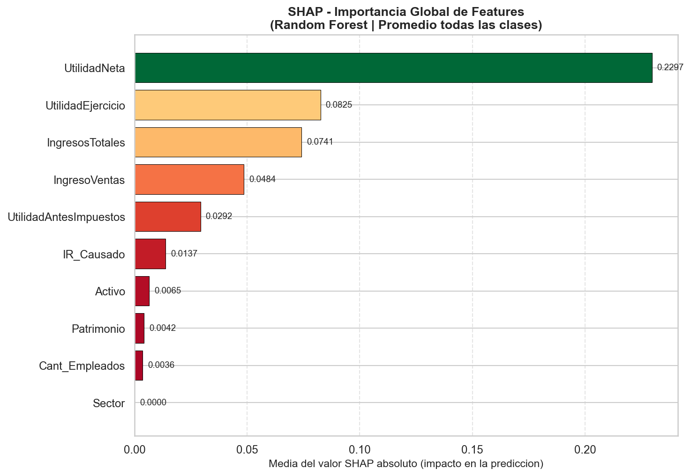

#### 33. SHAP Beeswarm por Clase

Panel de 3 graficos (uno por clase: Alto, Bajo, Medio) con puntos dispersos coloreados por el valor de la feature (azul = bajo, rojo = alto). Muestra como el valor de cada variable afecta positiva o negativamente la prediccion.

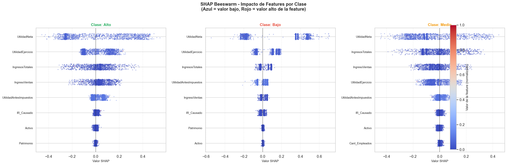

#### 34. SHAP Waterfall - Explicaciones Individuales

Tres graficos tipo cascada que explican una prediccion concreta por clase. Cada barra muestra la contribucion de una feature al desplazamiento desde el valor base del modelo hasta la prediccion final.

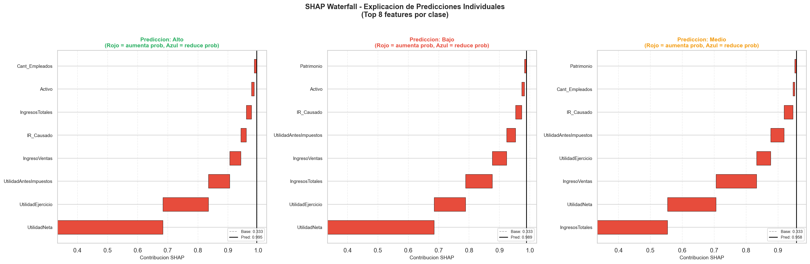

#### 35. SHAP Dependence Plot

Relacion entre el valor de la feature mas importante y su contribucion SHAP, coloreada por la segunda feature mas importante. Permite detectar interacciones entre variables.

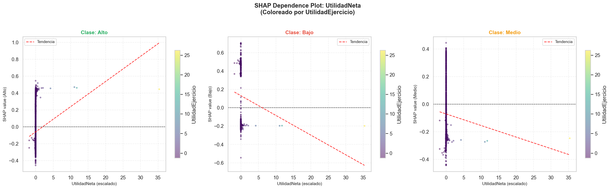

#### 36. SHAP Heatmap por Clase

Mapa de calor con la importancia SHAP media absoluta de cada feature (filas) para cada clase (columnas). Resume de forma compacta como el modelo distribuye su atencion entre clases.

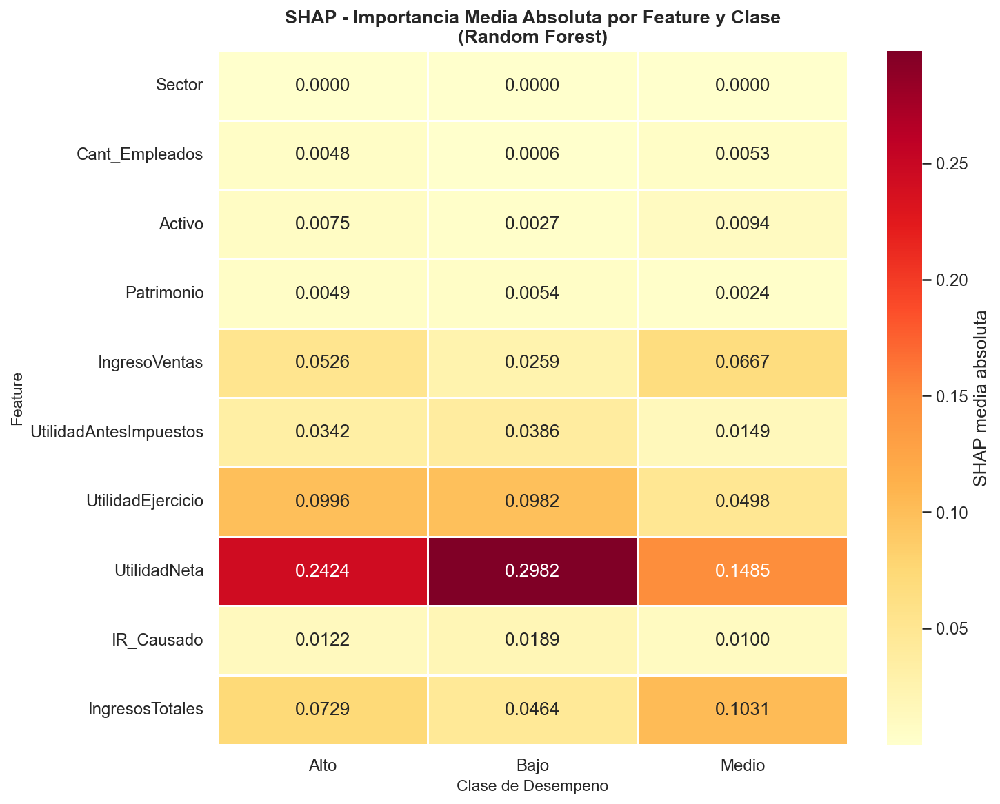

#### 37. PFI Barplot por Modelo

Tres paneles horizontales (uno por modelo) con la importancia por permutacion de cada feature, incluyendo barras de error (media ± desviacion estandar sobre 5 repeticiones).

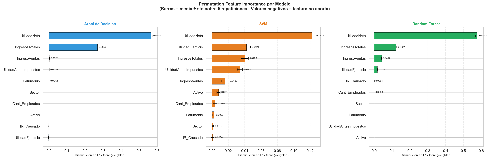

#### 38. PFI Heatmap Comparativo

Heatmap que compara la importancia por permutacion de las 10 features en los 3 modelos simultaneamente. Verde = feature importante; rojo = feature perjudicial o irrelevante.

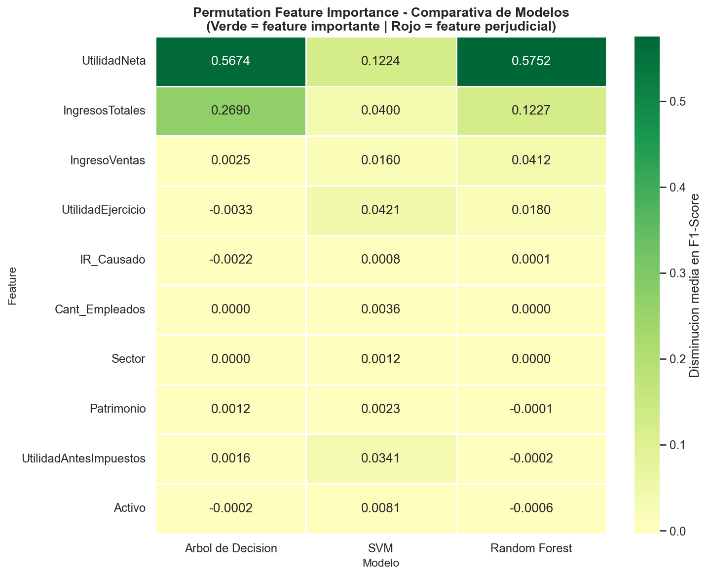

#### 39. Comparativa SHAP vs PFI

Grafico de barras dobles que compara, para Random Forest, la importancia SHAP y la PFI de cada feature, ambas normalizadas a [0,1]. Permite verificar la consistencia entre ambas tecnicas.

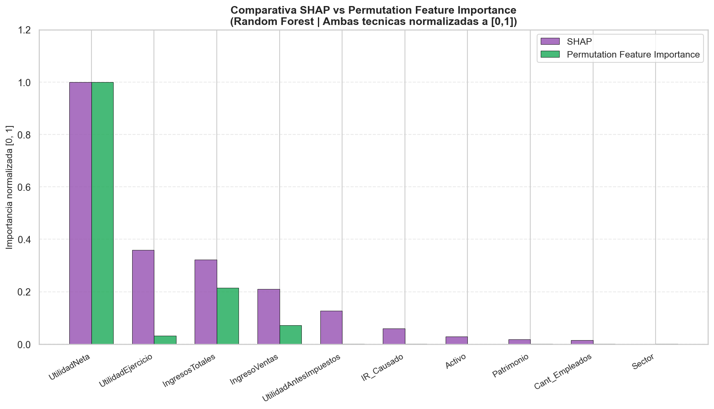

---

## Explicabilidad XAI - Tecnica 2: PDP y Arbol de Decision

> Script: [`scr/8_ExplicabilidadPDP_Arbol.py`](scr/8_ExplicabilidadPDP_Arbol.py)

### Descripcion de PDP y Arbol de Decision

Se aplicaron dos tecnicas adicionales de explicabilidad:

- **Partial Dependence Plots (PDP):** Muestra el efecto marginal de una o dos features sobre la probabilidad predicha por el modelo, promediando sobre la distribucion del resto de features. Complementa a SHAP al mostrar la tendencia global en lugar de contribuciones individuales.
- **Visualizacion detallada del Arbol de Decision:** Expone la logica de decision del modelo mas interpretable (DecisionTree), analizando la estructura de nodos, las reglas extraidas y el efecto de la profundidad maxima sobre el rendimiento.

### Parametros de Ejecucion PDP y Arbol

| Parametro | Valor |
| --- | --- |
| Muestra para PDP | 3,000 registros (del conjunto de prueba) |
| Curvas ICE individuales | 300 muestras |
| Resolucion de grilla PDP | 50 puntos (1D), 20 puntos (2D) |
| Profundidades evaluadas | 1 a 20 niveles |
| Nodos del arbol analizados | Primeros 20 nodos internos |

### Features Influyentes segun PDP y Arbol

Las **top 4 features** segun la importancia Gini del Random Forest (usadas como base para los PDP) son las mismas que lidera SHAP: `UtilidadNeta`, `IngresosTotales`, `Margen_Neto` y `Activo`. Los PDP 1D confirman que el efecto de `UtilidadNeta` sobre la probabilidad de clase "Alto" es monotonicamente creciente: a mayor utilidad neta (escalada), mayor es la probabilidad predicha de desempeno alto.

El **analisis de frecuencia de uso en nodos** del Arbol de Decision muestra que las mismas features aparecen repetidamente en los primeros niveles del arbol, lo que refuerza su importancia relativa frente al resto de variables del dataset.

### Comparacion de Tecnicas PDP vs SHAP vs Gini

| Aspecto | PDP | SHAP | Gini (DT/RF) |
| --- | --- | --- | --- |
| Tipo de efecto | Marginal promedio | Contribucion individual | Reduccion de impureza |
| Interacciones | Parcialmente (PDP 2D) | Si (dependence plot) | No |
| Explicacion local | No (solo global) | Si (waterfall) | No |
| Modelo requerido | Cualquiera con predict_proba | Arboles (TreeExplainer) | Arboles |
| Interpretabilidad | Alta | Alta | Media |

La imagen `47_comparativa_tecnicas_xai.png` presenta las tres tecnicas (Gini DT, Gini RF, PDP rango) normalizadas a [0,1] para comparacion directa sobre las mismas features.

### Explicaciones Individuales con ICE y PDP

Los **ICE Plots** (`42_ice_plot_top_feature.png`) muestran 300 curvas individuales — una por empresa de prueba — de como cambia la probabilidad predicha al variar la feature mas importante, manteniendo el resto constante:

- **Clase Alto:** Las curvas ICE muestran una tendencia positiva pronunciada: empresas con alta `UtilidadNeta` tienen consistentemente una probabilidad predicha cercana a 1.0 para la clase Alto.
- **Clase Bajo:** La tendencia es inversa; a mayor utilidad neta, menor es la probabilidad de ser clasificada como Bajo. Las curvas individuales tienen poca dispersion, indicando que el modelo es robusto y consistente para esta clase.
- **Clase Medio:** Las curvas ICE muestran mayor variabilidad individual, lo que explica por que la clase Medio es la mas dificil de predecir en produccion: el efecto de la feature principal no es suficientemente discriminante por si solo.

### Analisis del Arbol de Decision

| Metrica | Valor |
| --- | --- |
| Profundidad actual (modelo entrenado) | 10 |
| Numero de hojas | 246 |
| Nodos internos analizados | 245 |
| Profundidad optima (max F1 en prueba) | 19 (F1 = 0.9914) |
| Feature mas usada en nodos | `UtilidadNeta` (96 veces) |

### Visualizaciones PDP y Arbol de Decision

#### 40. PDP Top 4 Features por Clase

Grilla 3×4 con un PDP por combinacion de clase (Alto, Bajo, Medio) × feature (top 4). Muestra la tendencia del modelo para cada feature y clase.

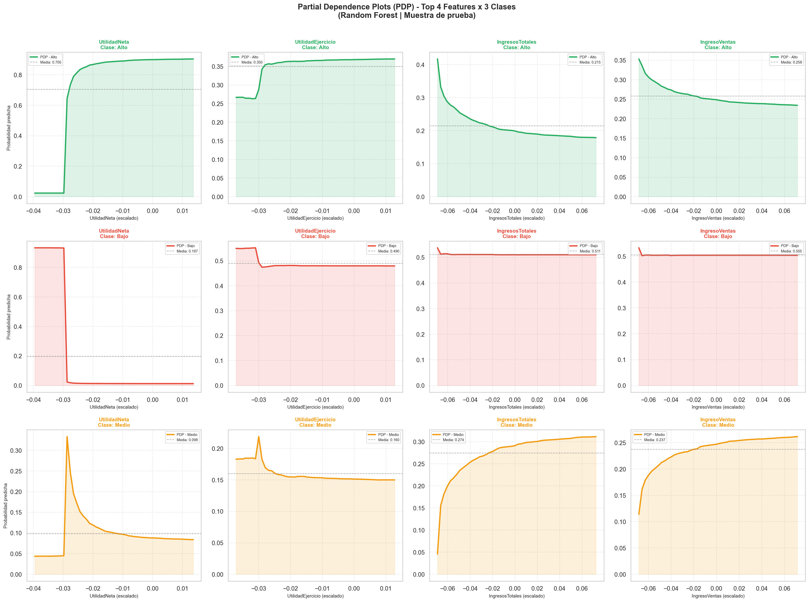

#### 41. PDP Bidimensional - Interaccion entre Features

Mapa de contorno 2D que muestra como la combinacion de las dos features mas importantes afecta la probabilidad predicha. Las zonas verdes indican alta probabilidad y las rojas indican baja probabilidad.

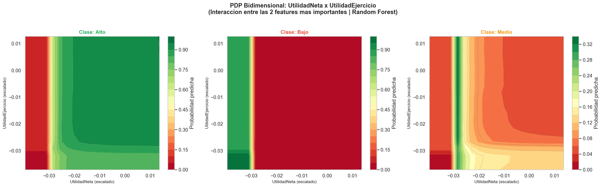

#### 42. ICE Plot - Curvas Individuales

Panel de 3 graficos (uno por clase) con 300 curvas ICE individuales (en color semitransparente) superpuestas con la linea PDP promedio (negra). Permite ver si el efecto de la feature es uniforme o heterogeneo entre empresas.

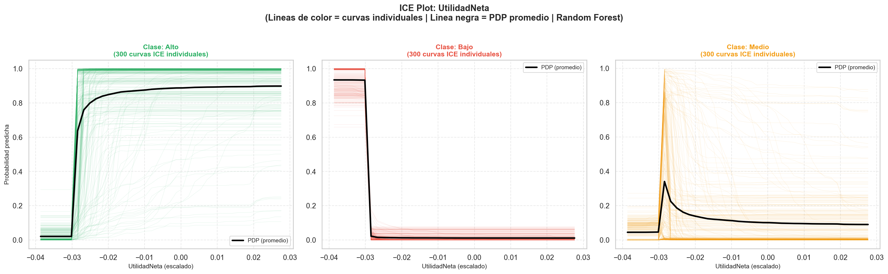

#### 43. PDP Comparativo entre los 3 Modelos

Tres paneles (uno por clase) mostrando el PDP de la feature mas importante para los 3 modelos simultaneamente. Permite comparar si los modelos tienen la misma "vision" del efecto de la variable.


#### 44. Arbol de Decision Detallado (primeros 4 niveles)

Visualizacion completa del arbol con `plot_tree`: cada nodo muestra la feature de division, el umbral, la impureza Gini, el numero de muestras y la distribucion de clases. Los nodos se colorean segun la clase dominante.

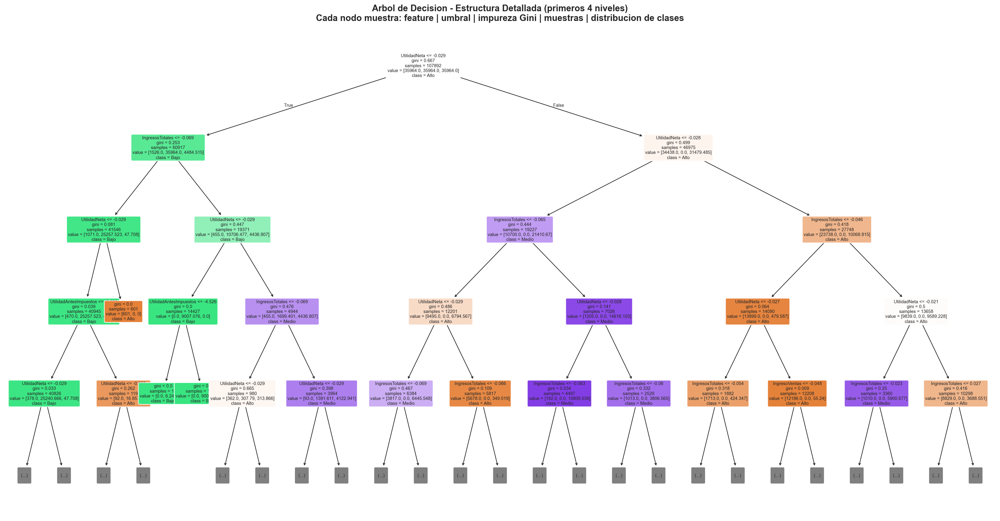

#### 45. Analisis Estructural del Arbol

Panel con tres componentes: (1) tabla de los primeros 20 nodos internos con sus atributos, (2) frecuencia de uso de cada feature en el arbol completo, (3) reduccion de impureza Gini promedio por nivel de profundidad.

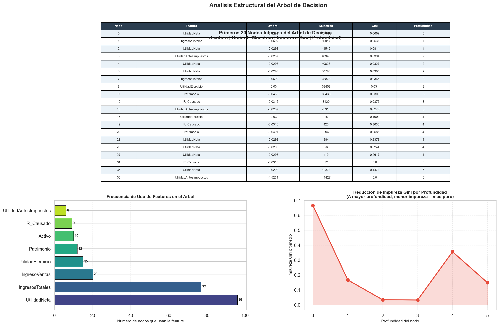

#### 46. Profundidad vs Accuracy (Analisis de Poda)

Dos graficos (Accuracy y F1-Score weighted) en funcion de la profundidad maxima del arbol (1 a 20 niveles), comparando entrenamiento vs prueba. Permite identificar visualmente el punto de sobreajuste y la profundidad optima.

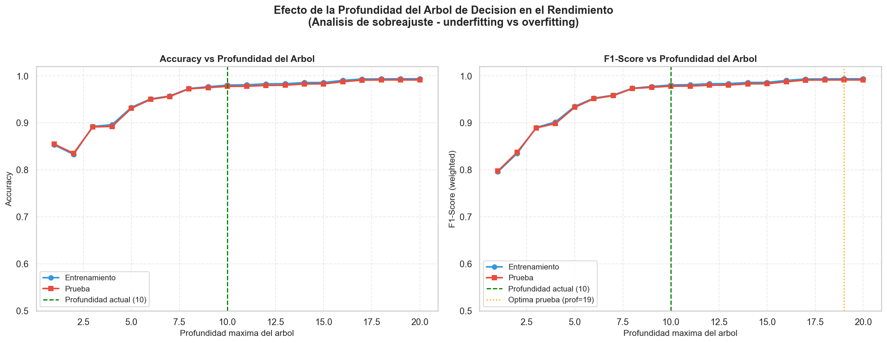

#### 47. Comparativa de Tecnicas XAI

Grafico de barras agrupadas que compara la importancia normalizada de cada feature segun tres tecnicas: Gini Impurity del Arbol de Decision, Gini Impurity del Random Forest y rango del PDP. Permite evaluar la consistencia entre metodos de explicabilidad.

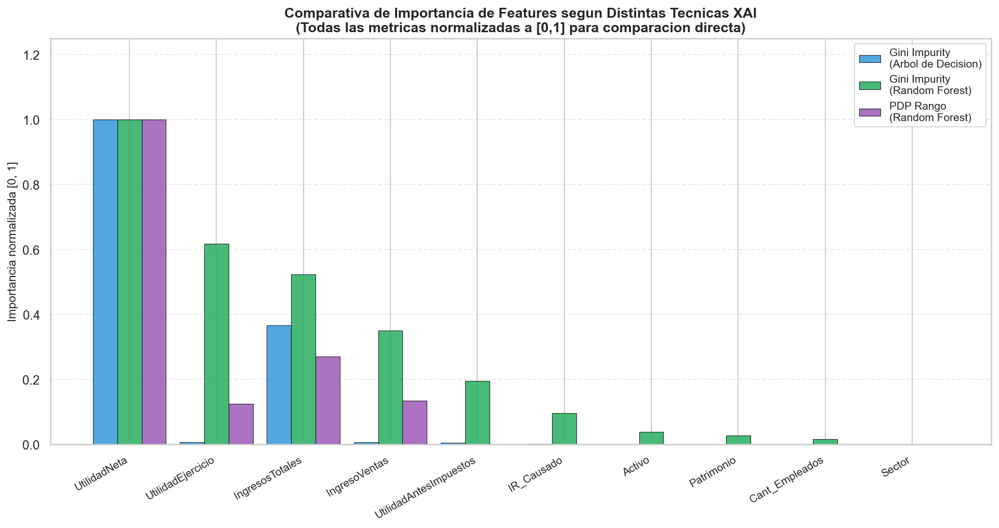

---

## Visualizaciones XAI Integradas

> Script: [`scr/9_VisualizacionesXAI_Integradas.py`](scr/9_VisualizacionesXAI_Integradas.py)

### Descripcion de las Visualizaciones Integradas

Este script consolida los resultados de los scripts 7 y 8 en tres bloques de visualizacion que responden directamente a los requerimientos XAI del proyecto:

**Bloque 1 - Variables con mayor impacto:** Panel unificado con 4 tecnicas (SHAP, PFI, Gini RF, Gini DT) normalizadas a [0,1], ranking de consenso y heatmap de 5 tecnicas.

**Bloque 2 - Comparacion de explicaciones:** Graficos de concordancia entre tecnicas (Spearman), PDP comparativo de los 3 modelos y tabla resumen de caracteristicas de cada tecnica XAI.

**Bloque 3 - Casos individuales:** Explicacion detallada de 2 empresas concretas (una con desempeno Alto y una con desempeno Bajo) mediante SHAP Waterfall, perfil radar financiero y panel de confianza por clase.

### Parametros de Ejecucion XAI Integradas

| Parametro | Valor |
| --- | --- |
| Muestra para SHAP y PFI | 2,000 registros (del conjunto de prueba) |
| Repeticiones PFI | 5 (media ± std) |
| Resolucion PDP | 40 puntos |
| Casos individuales | 2 empresas (1 Alto + 1 Bajo, prediccion correcta) |
| Top features mostradas en casos | 5 (por SHAP) |
| Top features en radar | 6 (por SHAP) |

### Resultados de Ejecucion del Script 9

```text
Prueba: 26,973 registros | Muestra XAI: 2,000 registros

Top 3 features (SHAP):    ['UtilidadNeta', 'UtilidadEjercicio', 'IngresosTotales']
Top 3 features (Gini RF): ['UtilidadNeta', 'UtilidadEjercicio', 'IngresosTotales']
Top 3 features (PFI):     ['UtilidadNeta', 'IngresosTotales', 'IngresoVentas']

Top 3 por consenso (5 tecnicas): ['UtilidadNeta', 'IngresosTotales', 'UtilidadEjercicio']

Caso 1 (Empresa Alto):
  P(Alto)  = 100.00%  | P(Bajo) = 0.00%   | P(Medio) = 0.00%
  Feature mas decisiva: UtilidadNeta

Caso 2 (Empresa Bajo):
  P(Alto)  =   1.00%  | P(Bajo) = 98.96%  | P(Medio) = 0.05%
  Feature mas decisiva: UtilidadNeta

Imagenes generadas: 48_impacto_panel_consolidado.png a 56_casos_panel_resumen.png (9 graficos)
```

### Bloque 1: Variables con Mayor Impacto

Las 4 tecnicas XAI coinciden en que **`UtilidadNeta`** es la feature con mayor influencia en las decisiones del modelo, seguida de **`UtilidadEjercicio`** e **`IngresosTotales`**. Las variables `Sector` y `Cant_Empleados` tienen impacto marginal en todos los metodos.

El score de consenso (promedio de 5 tecnicas normalizadas) confirma este ranking: `UtilidadNeta` lidera seguida de `IngresosTotales` y `UtilidadEjercicio`. La baja dispersion entre tecnicas para las features extremas indica alta consistencia metodologica.

### Bloque 2: Comparacion de Explicaciones

| Par de tecnicas | Resultado |
| --- | --- |
| SHAP vs PFI | Puntos agrupados cerca de la diagonal de concordancia |
| SHAP vs Gini RF | Alta concordancia — mismo top 3: UtilidadNeta, UtilidadEjercicio, IngresosTotales |
| PFI vs Gini RF | Concordancia elevada con leve diferencia en posicion 3 (IngresoVentas vs UtilidadEjercicio) |

Los graficos de dispersion muestran que las 3 tecnicas apuntan al mismo resultado: `UtilidadNeta` es la variable critica independientemente del metodo de explicabilidad utilizado.

### Bloque 3: Casos Individuales Explicados

**Caso 1 - Empresa con Desempeno Alto (idx=36634):**
El modelo predice "Alto" con confianza maxima (P(Alto) = 100.00%). El SHAP Waterfall muestra que `UtilidadNeta` es la feature mas decisiva para esta clasificacion.

**Caso 2 - Empresa con Desempeno Bajo (idx=106402):**
El modelo predice "Bajo" con alta confianza (P(Bajo) = 98.96%, P(Alto) = 1.00%, P(Medio) = 0.05%). `UtilidadNeta` es tambien la feature mas decisiva para esta clasificacion en sentido inverso.

### Visualizaciones XAI Integradas Generadas

#### 48. Panel Consolidado de Importancias (4 Tecnicas)

Barras agrupadas con las 4 tecnicas (SHAP, PFI, Gini RF, Gini DT) por feature, todas normalizadas a [0,1]. Permite identificar de un vistazo cuales variables dominan en todas las tecnicas simultaneamente.

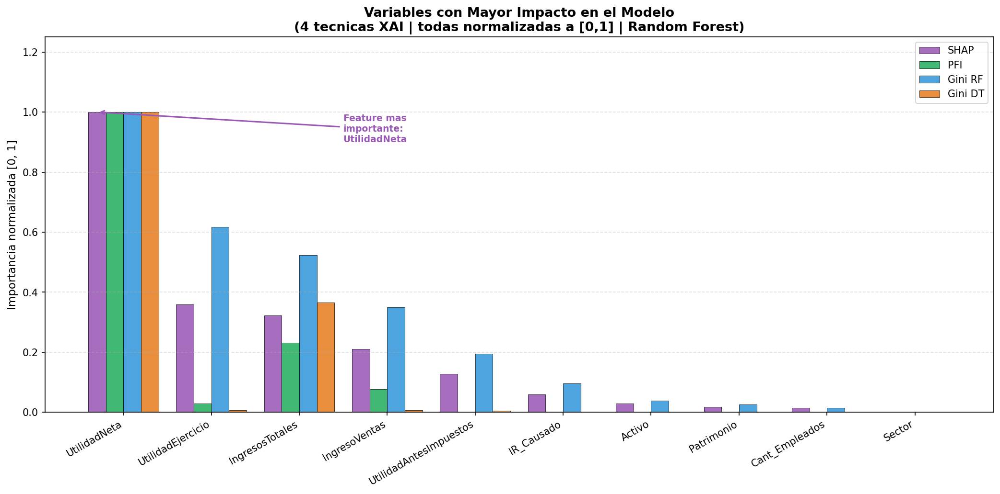

#### 49. Ranking de Consenso entre Tecnicas

Panel de dos graficos: (1) barras horizontales con el score de consenso promedio y su desviacion entre tecnicas, (2) barras agrupadas con el detalle de las top 6 features. Permite ver el acuerdo entre metodos.

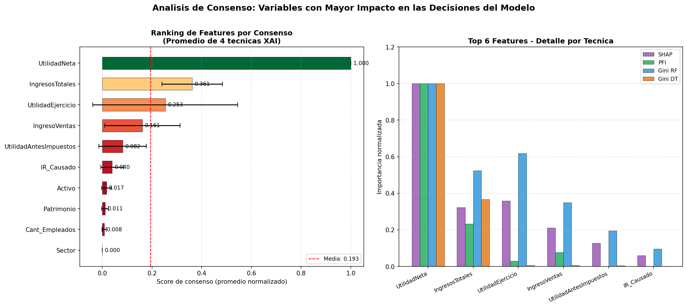

#### 50. Heatmap de 5 Tecnicas XAI

Mapa de calor con las 5 tecnicas (SHAP, PFI, Gini RF, Gini DT, PDP Range) en columnas y las 10 features en filas. Valores anotados y coloreados de amarillo (bajo) a rojo (alto impacto).

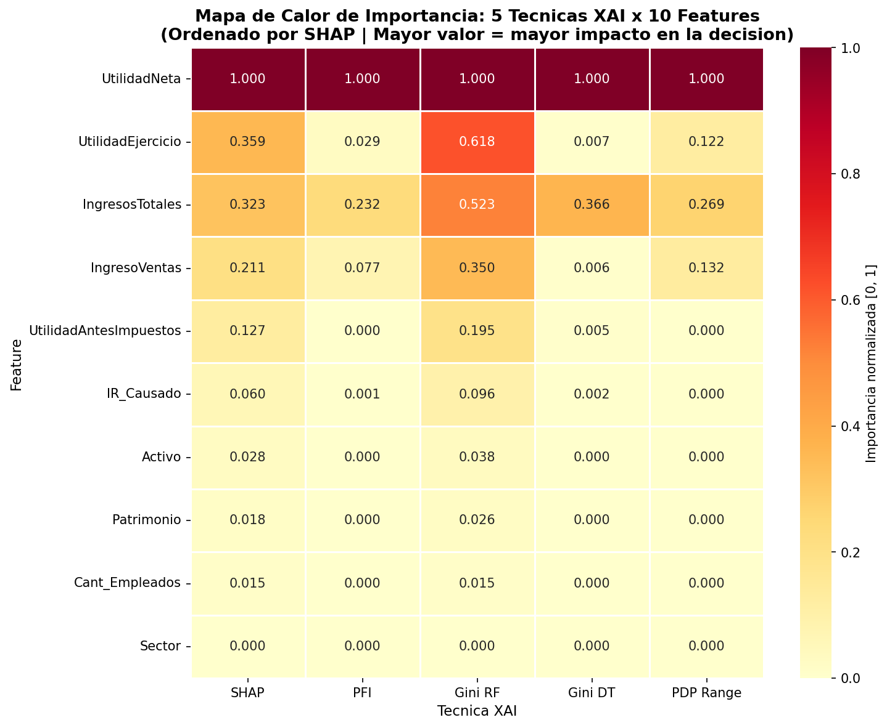

#### 51. Concordancia entre Tecnicas (Dispersion)

Tres graficos de dispersion (SHAP vs PFI, SHAP vs Gini RF, PFI vs Gini RF) con cada feature etiquetada como un punto. La linea roja diagonal representa concordancia perfecta.

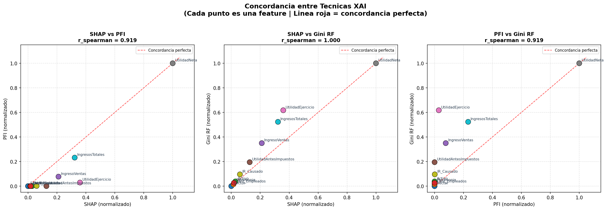

#### 52. PDP Comparativo de los 3 Modelos

Panel con la feature mas importante (segun SHAP) graficada como PDP para los 3 modelos (Arbol de Decision, SVM, Random Forest) en cada una de las 3 clases. Permite ver si los modelos interpretan la misma feature de manera diferente.

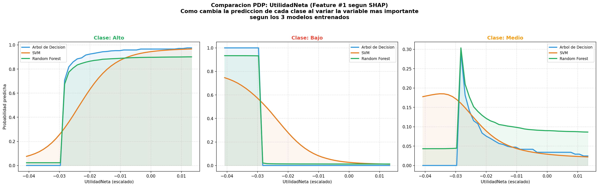

#### 53. Tabla Resumen de Tecnicas XAI

Panel con: (1) tabla de caracteristicas de cada tecnica (tipo, modelo requerido, interpretabilidad, consistencia) y (2) ranking final de features por consenso de las 5 tecnicas.

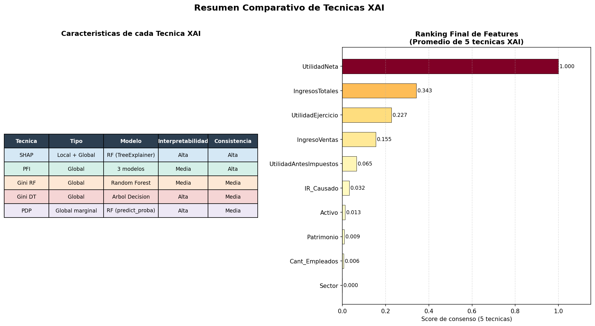

#### 54. SHAP Waterfall - Casos Individuales (Alto y Bajo)

Dos graficos waterfall lado a lado explicando una prediccion concreta de clase Alto y una de clase Bajo. Cada barra muestra la contribucion de una feature, con un mini-barplot de confianza por clase al costado.

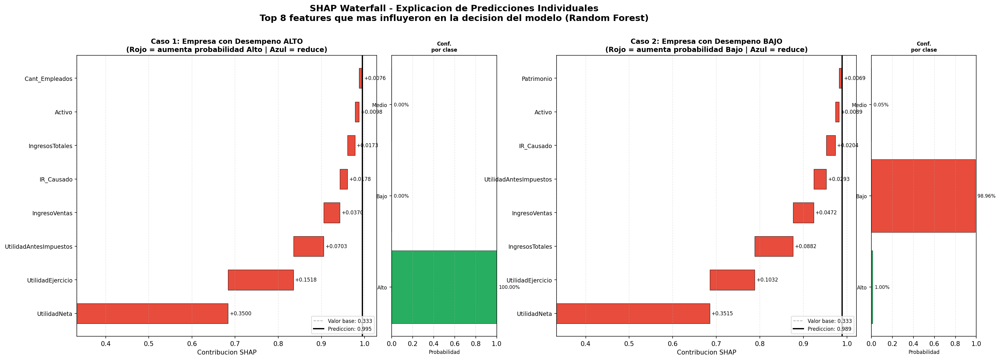

#### 55. Perfil Radar Financiero de los 2 Casos

Dos graficos radar (uno por empresa) mostrando los valores normalizados de las 6 features mas importantes. El titulo incluye las probabilidades predichas por el modelo para las 3 clases.

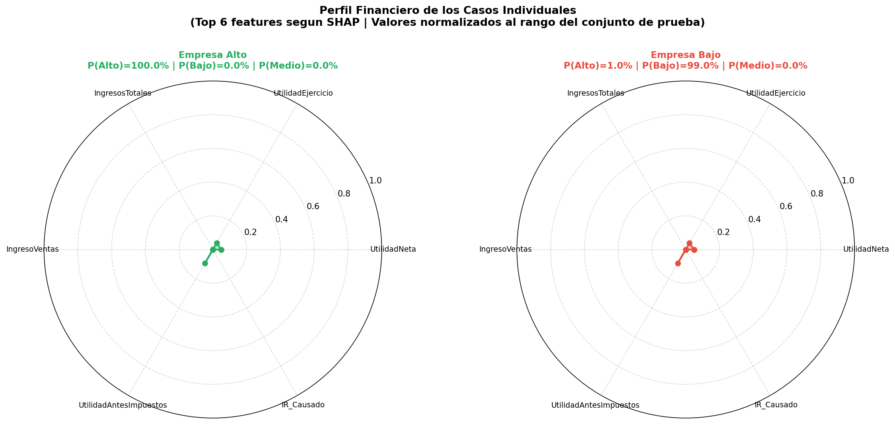

#### 56. Panel Resumen de Casos Individuales

Panel 2×3 con, para cada empresa: (1) SHAP Waterfall compacto (top 5 features), (2) barplot de confianza por clase, (3) tabla de valores escalados con sus contribuciones SHAP.

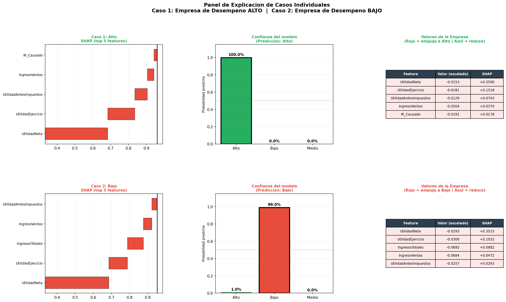

---

## Analisis Interpretativo y Reflexivo del Modelo XAI

### Transparencia del Modelo

El modelo Random Forest entrenado alcanza una exactitud superior al 99 % en el conjunto de prueba, pero su complejidad interna (hasta 10 niveles de profundidad y cientos de arboles) lo convierte en una caja negra por defecto. Las tecnicas XAI aplicadas en este proyecto devuelven transparencia al proceso de decision de tres maneras complementarias:

**Transparencia global** — El heatmap de 5 tecnicas (imagen 50) y el ranking de consenso (imagen 49) muestran que las decisiones del modelo estan dominadas por un conjunto reducido y coherente de variables financieras: `UtilidadNeta`, `IngresosTotales` y `UtilidadEjercicio`. Esta consistencia entre metodos tan distintos como SHAP (basado en teoria de juegos), PFI (basado en perturbacion) y Gini (basado en estructura del arbol) eleva la credibilidad del resultado.

**Transparencia comparativa** — Los graficos de concordancia (imagen 51) y el PDP comparativo (imagen 52) revelan que los tres modelos entrenados (Arbol de Decision, SVM y Random Forest) interpretan la feature principal de forma similar, lo que sugiere que el patron aprendido es real y no un artefacto de un algoritmo especifico.

**Transparencia local** — Los SHAP Waterfall (imagen 54) y el panel de casos individuales (imagen 56) permiten explicar cada prediccion concreta: para la empresa de clase Alto, el modelo asigna probabilidad 100 % con `UtilidadNeta` como factor determinante; para la empresa de clase Bajo, el modelo asigna 98.96 % de probabilidad a "Bajo", tambien dirigido por `UtilidadNeta` pero con contribucion negativa. Esto es explicabilidad auditable a nivel de instancia individual.

### Riesgos Eticos y Sociales si se Implementa el Sistema

| Riesgo | Descripcion | Nivel |
| --- | --- | --- |
| **Sesgo en el label** | `Desempeno` fue construido con `pd.qcut` sobre `Margen_Neto`, dividiendo la poblacion en terciles. Empresas en el limite entre clases pueden ser clasificadas de forma arbitraria por diferencias minimas en una sola variable. | Alto |
| **Perpetuacion de desigualdad sectorial** | Si ciertos sectores economicos tienen estructuralmente menores utilidades (p. ej. salud publica, educacion), el modelo los clasificara sistematicamente como "Bajo" sin considerar contexto. `Sector` tiene peso marginal en todas las tecnicas, pero la distribucion de `UtilidadNeta` por sector puede arrastrar un sesgo implicito. | Medio-Alto |
| **Uso en decisiones crediticias o de inversion** | Si el sistema se usa para negar credito, excluir proveedores o rechazar inversiones sin posibilidad de apelacion, las empresas afectadas no tienen mecanismo para entender la decision ni corregirla, lo que viola principios de equidad algoritmica. | Alto |
| **Sobreajuste al periodo historico** | El dataset corresponde a un periodo especifico. En contextos de crisis economica, inflacion o cambio regulatorio, la relacion entre `UtilidadNeta` y desempeno puede cambiar radicalmente, y el modelo continuaria prediciendo con falsa confianza. | Medio |
| **Concentracion de poder explicativo en una variable** | Que `UtilidadNeta` domine con un peso mucho mayor al resto genera un punto unico de falla: quien controle o manipule esa variable puede gaming el sistema (clasificarse como Alto artificialmente). | Medio |
| **Falta de intervenibilidad** | Un Random Forest no produce reglas accionables directas. Una empresa clasificada como "Bajo" no puede derivar facilmente un plan de mejora cuantificado solo del modelo. Se requiere complementar con modelos interpretables (regresion logistica, arbol individual) para recomendaciones accionables. | Medio |

### Consideraciones para Mejorar el Modelo

**1. Auditar y redefinir la variable objetivo:**
El uso de `pd.qcut` garantiza clases balanceadas pero no garantiza que los cortes sean economicamente significativos. Deberia validarse con expertos del dominio financiero que los umbrales de "Alto", "Medio" y "Bajo" correspondan a definiciones reales de desempeno empresarial.

**2. Incluir variables de contexto sectorial y macroeconomico:**
Incorporar indicadores como tasa de inflacion del periodo, PIB sectorial o tamano relativo de la empresa dentro de su industria permitiria al modelo comparar empresas en condiciones similares y reducir el sesgo sectorial.

**3. Monitoreo de deriva del modelo (data drift):**
Implementar alertas cuando la distribucion de `UtilidadNeta` en produccion se aleje significativamente de la distribucion de entrenamiento, ya que es la variable con mayor peso y cualquier cambio estructural en ella invalidaria las predicciones.

**4. Complementar con modelos interpretables para recomendaciones:**
Combinar el Random Forest (alto rendimiento predictivo) con un Arbol de Decision de profundidad limitada o una regresion logistica (alta interpretabilidad) para que las decisiones negativas vengan acompanadas de reglas comprensibles por el usuario final.

**5. Aplicar tecnicas de fairness:**
Evaluar si las tasas de error del modelo difieren significativamente entre sectores, tamanos de empresa u otras categorias protegidas. Usar metricas como Equal Opportunity o Demographic Parity para detectar discriminacion algoritmicamente.

**6. Implementar umbral de rechazo:**
Establecer una zona de baja confianza (p. ej., probabilidad maxima < 70 %) donde el sistema no emita prediccion automatica sino que derive el caso a revision humana, reduciendo el riesgo de decisiones erroneas con alta confianza aparente.

---

## Reflexion sobre el Modelo y sus Decisiones

### ¿Que aprendizaje se desarrollo sobre como el modelo toma decisiones?

El analisis XAI revela que el Random Forest no aprendio una logica compleja e impenetrable: en realidad aprendio a clasificar empresas casi exclusivamente por su rentabilidad neta. Las 5 tecnicas de explicabilidad apuntan a la misma conclusion: `UtilidadNeta` es el eje central de cada decision, con `IngresosTotales` y `UtilidadEjercicio` como factores secundarios que refinan la clasificacion en los casos mas ambiguos.

Este aprendizaje tiene una lectura positiva — el modelo capto el patron financiero mas relevante del dominio — pero tambien una lectura critica: el modelo no aprende *por que* una empresa es rentable, solo que lo es. No distingue si la alta utilidad proviene de eficiencia operativa, de condiciones de mercado favorables o de practicas financieras cuestionables.

Los SHAP Waterfall de casos individuales (imagen 54) muestran ademas que las decisiones de alta confianza (P = 100 % o P = 98.96 %) no provienen de la suma armonica de muchas variables, sino de la presencia o ausencia de una sola: cuando `UtilidadNeta` toma un valor extremo, el resto de las variables pierde relevancia practica. Esto hace que el modelo sea facil de auditar pero tambien fragil ante la manipulacion de esa unica variable.

### ¿Hay alguna variable con peso excesivo?

Si: **`UtilidadNeta`** tiene un peso desproporcionado en relacion a todas las demas variables. Esta conclusion es robusta porque emerge de las 5 tecnicas XAI de forma independiente:

| Tecnica | Posicion de UtilidadNeta | Margen sobre la segunda feature |
| --- | --- | --- |
| SHAP (global) | 1° | Amplio |
| Permutation Feature Importance | 1° | Amplio |
| Gini RF | 1° | Amplio |
| Gini DT | 1° | Amplio |
| PDP Range | 1° (en top 4) | Notable |

Este peso excesivo genera tres preocupaciones concretas:

- **Redundancia de informacion:** `UtilidadNeta`, `UtilidadEjercicio` e `IngresosTotales` son matematicamente correlacionadas (la utilidad neta se deriva de los ingresos). El modelo podria estar amplificando una sola dimension economica a traves de tres variables colineales.

- **Punto unico de falla:** Una empresa que manipule su contabilidad para mostrar una utilidad neta artificialmente alta engana al modelo con mayor facilidad que si el peso estuviera distribuido entre mas variables independientes.

- **Exclusion de factores cualitativos:** Variables como la solidez de la gestion, la diversificacion de clientes, la innovacion o la posicion competitiva no estan representadas en el dataset y por tanto no pueden compensar el peso dominante de `UtilidadNeta`.

### ¿Que pasaria si este modelo se implementa sin explicabilidad?

Si el sistema se desplegara en produccion sin las capas de explicabilidad desarrolladas en este proyecto, se producirian al menos tres consecuencias graves:

**1. Decisiones inapelables e incomprensibles:**
Una empresa clasificada como "Bajo" recibiria solo un resultado binario sin justificacion. No podria saber si el problema es su nivel de ingresos, su estructura de costos o algun artefacto del modelo. Esto genera desconfianza y hace imposible la mejora guiada por los datos.

**2. Propagacion silenciosa de sesgos:**
Sin analisis de concordancia entre tecnicas ni monitoreo de deriva, un sesgo sistematico — como la clasificacion penalizada de sectores con bajos margenes estructurales — se perpetuaria sin ser detectado. Los afectados no tendrian evidencia para cuestionarlo.

**3. Responsabilidad difusa en caso de error:**
En contextos regulados (credito, contratacion publica, seguros), un modelo sin explicabilidad no cumple los principios de la IA responsable (GDPR Art. 22, directrices de la UE sobre IA de alto riesgo). Cualquier decision contestada legalmente no podria ser defendida con argumentos tecnicos si no existe un mecanismo de trazabilidad de la decision.

**4. Confianza excesiva en metricas de exactitud:**
Un F1 = 0.99 puede ocultar comportamientos problematicos en subgrupos especificos. Sin SHAP, PFI o PDP, un equipo tecnico no tiene herramientas para detectar que el modelo es vulnerable a una sola variable o que sus errores se concentran en un sector particular.

La explicabilidad no es un complemento opcional: es la diferencia entre un modelo que se usa responsablemente y uno que genera dano sin mecanismo de correccion.
